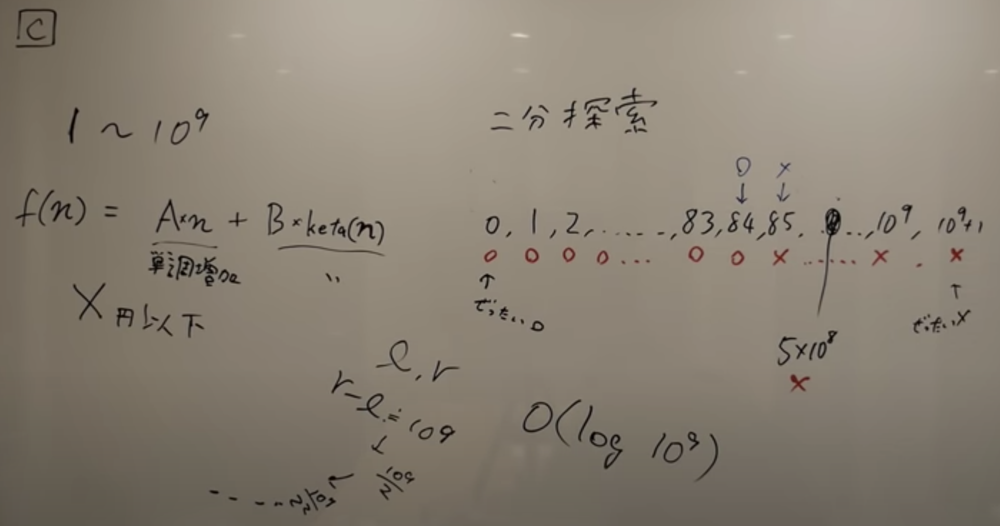

# [AtCoder Beginner Contest 146](https://atcoder.jp/contests/abc146)

## [D - Coloring Edges on Tree](https://atcoder.jp/contests/abc146/tasks/abc146_d)
- 解説は Notion に有り．

## [C - Buy an Integer](https://atcoder.jp/contests/abc146/tasks/abc146_c)
- 短調増加の関数なので二分探索を用いる問題．
- 二分探索は `o` と `x` のカーソルを対象の値を判定しながら，両脇から移動させていくイメージ．

