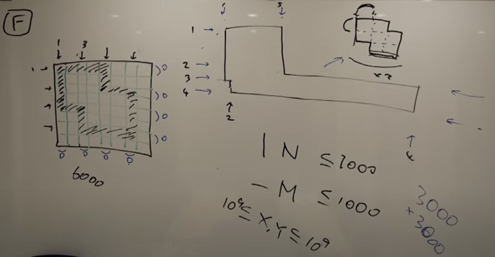
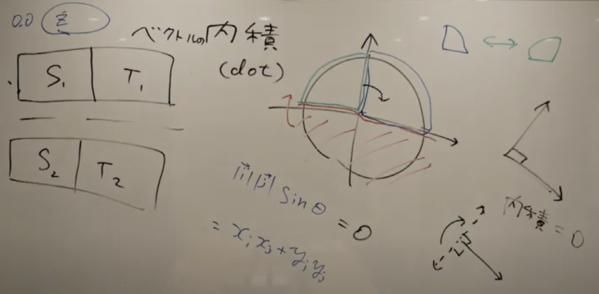

# [AtCoder Beginner Contest 168](https://atcoder.jp/contests/abc168)

## [F - . (Single Dot)](https://atcoder.jp/contests/abc168/tasks/abc168_f)
- `座標圧縮`と`グリッドでの BFS` を用いる問題．
    - 愚直にグリッドを用意するとメモリが足りないので，頂点の数だけ配列を用意する．
    - 画像圧縮とは x が左から何本目ですか？が分かれば良い．と考えて良い．
    - 形の相似形を用いる．
    - あとで1グリッドの大きさを戻してあげる．
- 壁の厚さを1グリッドとして考えると BFS がより簡単に実装できる．
- 座標を定めてグリッドでの BFS を行う．
- BFS は最短経路だけでなく，到達可能かどうかも判断できる．
    - dist を 1 とかにすれば良い．
- 

## [E - ∙ (Bullet)](https://atcoder.jp/contests/abc168/tasks/abc168_e)
- xy 平面上で`ベクトルの内積`，`gcd`，`180°回転`，`90°回転`，`座標の連想配列`を用いてグループ分けを行う問題．
    - 同じグループなら同じ値になるようなグループ分けを上手に行う．
- `A_i * A_j + B_i * B_j = 0` の条件から選んでは行けないグループでのグループ分けを行う．
    - 上の式を式変形して，変数を独立させて，A / B でグループ分けを行う．
    - または，上の式はベクトルの内積そのものなので，ベクトルの内積を使って，上手にグループ分けを行う．
    - `vec(A) = (A_i, B_i)`, `vec(B) = (A_j, B_j)` のとき，`vec(A)` と `vec(B)` の内積は以下の2つで表せれる．
    - `vec(A)∙vec(B) = |vec(A)|∙|vec(B)| * cos(theta)`
    - `vec(A)∙vec(B) = A_i * A_j + B_i * B_j`
    - `A_i * A_j + B_i * B_j = 0` なので，`cos(theta) = 0` つまり，`theta = 90°`
- 下の図のように，x 軸より下は180°回転されて，緑の部分と青い部分とに分ける．（2つのベクトルの内積が0（2つのベクトルの角度は90°）なので，2つのベクトル両方ともを一緒に180°回転させても2つのベクトルの関係性は保たれる）
- 緑色の部分と青色の部分が仲の悪いイワシグループになる．
- y 軸より左を90°回転させて，90°回転して (x, y) になるグループ（緑の部分）と，90°回転せずに (x, y) になるグループ（青い部分）とに分ける．
- これで組み合わせを考える．
- ただし，原点は例外処理する必要がある．
- 

## [D - .. (Double Dots)](https://atcoder.jp/contests/abc168/tasks/abc168_d)
- 無向グラフにおける最短経路問題に幅優先探索（BFS)を用いて pre を追加した問題．

## [C - : (Colon)](https://atcoder.jp/contests/abc168/tasks/abc168_c)
- 余弦定理使えば簡単に求まる．
